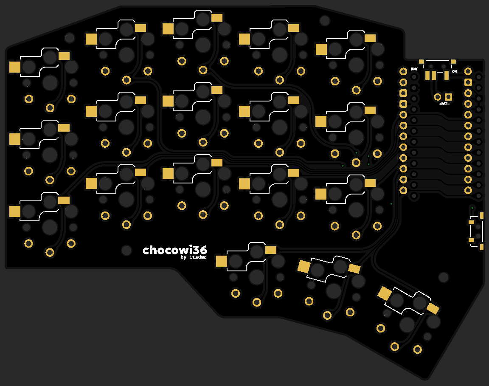
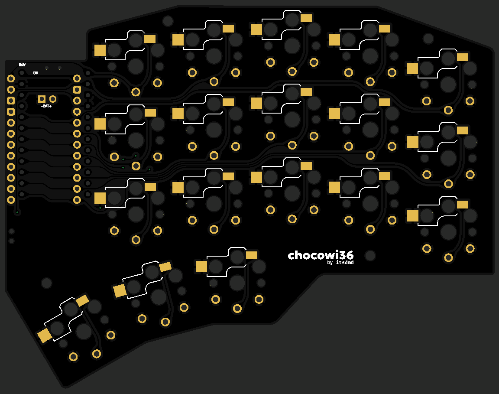
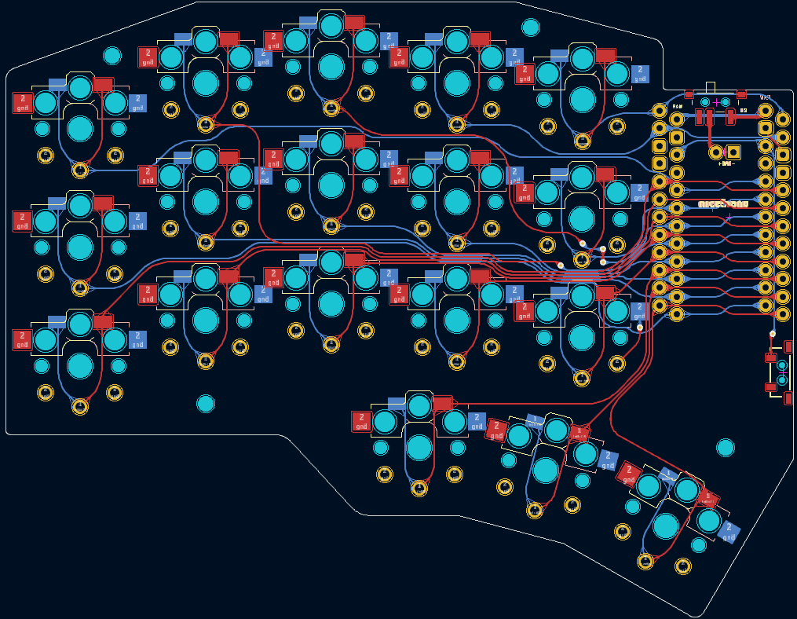

# Chocowi36

> A 36-key, low profile, wireless, split keyboard. Derived from [davidphilipbarr/Choc-Spaced-Corne](https://github.com/davidphilipbarr/Choc-Spaced-Corne), with the original design based on [Foostan's Corne](https://github.com/foostan/crkbd).

## Changes

-   The PCB shape, dimensions and mounting holes' position are modified to personal preferences.
-   Battery onboard connector is replaced with through hole pads for better flexibility. Power switch is connected to the positive terminal of the battery instead of ground.
-   The outermost thumb key has been changed to a 1u key, and the splayed angle of the thumb cluster has been increased to 15 degrees.
-   Allow the nice!nano to be mounted with the USB port facing down for both halves for better MCB protection.
-   Support both hotswap and soldered switches. Only Choc v1 switches are supported.

## Case

The case for the keyboard can be found here: [OnShape document](https://cad.onshape.com/documents/46b39ce86a53def7590272f1/w/488db377576b09efc6e15f6f/e/8a81a5fcc0753b2088ec2435)

This case features a 5.5x2.1 DC power jack for connecting to a detachable Li-Ion battery enclosure. The provided enclosure is designed for storing a 21700 battery with a protection PCB attached to it. This enclosure can act as a tenting mechanism, or for locking the two keyboard halves in place when folded for travelling. Most parameters can be _slightly_ adjust without breaking the whole thing. The screw holes are 3.0mm in diameter (for housing M2 heat inserts), and default tolerance is 0.3-0.5mm.

## Firmware

ZMK shield definition of chocowi36 can be obtained [here](https://github.com/itsdmd/zmk-dongle/tree/N!N_v2/config/boards/shields/chocowi36). Please note that the definition files are written for the keyboard to be used with a third nice!nano as the central/dongle.

The provided files should only act as the boilerplate, please adjust the configurations according to your personal needs and preferences. You can create your own repo using the [template](https://github.com/itsdmd/zmk-dongle) and make further modifications.

## Notes

There are two versions of the PCB, one with [straight traces](./pcb/gerber/straight/straight.zip) and one with [curved traces](./pcb/gerber/rounded/rounded.zip). There are no major differences between the two, mostly just aesthetics.

## Disclaimer

This is a **personal project** and not affiliated with the original authors. The gerber file has been checked against JLCPCB's DFM checker and no critical error was found. All files are provided as-is, **without any warranty or support**.
